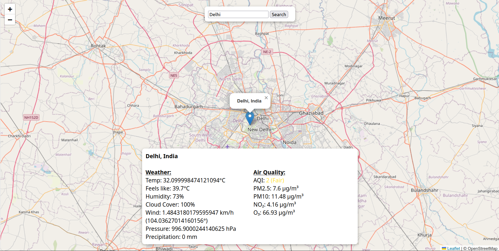

# Weather + AQI Map WebApp

**Live Site**: [https://aqi-indicator.onrender.com/](https://aqi-indicator.onrender.com/)


A Flask web app that shows live **weather** and **air quality (AQI)** based on user-selected location (search or map click).  

It uses:

- [Nominatim (OpenStreetMap)](https://nominatim.org/) – for geocoding addresses
- [Open-Meteo](https://open-meteo.com/) – for weather data
- [OpenWeatherMap AQI API](https://openweathermap.org/api/air-pollution) – for AQI (requires API key)

---

## Setup Instructions

### 1. Clone and install dependencies

#### Linux / macOS

```bash
git clone https://github.com/Veerhan-glitch/AQI-Indicator.git
cd AQI-Indicator

# Create and activate virtual environment
python3 -m venv venv
source venv/bin/activate

# Install dependencies
pip install -r requirements.txt
```

#### Windows (Command Prompt / PowerShell)

```cmd
git clone https://github.com/Veerhan-glitch/AQI-Indicator.git
cd AQI-Indicator

REM Create and activate virtual environment
python -m venv venv
venv\Scripts\activate

REM Install dependencies
pip install -r requirements.txt
```


### 2. Get your OpenWeatherMap API Key

- Go to: [OpenWeatherMap](https://home.openweathermap.org/api_keys)  
- Create an account (free) and copy your API key.

---

### 3. Create a `.env` file

In the root folder, create a `.env` file and add your OpenWeatherMap API key:

```env
OPENWEATHER_API_KEY=your_api_key_here
```

---

### 4. Run the Flask app

```bash
python app.py
```

Visit: [http://127.0.0.1:5000](http://127.0.0.1:5000)

---

## Features

- Search any location or on the map to fetch data
- Shows live weather (from Open-Meteo)
- Displays air quality (from OpenWeatherMap)

---

## Requirements

`requirements.txt`:

```txt
Flask
geopy
requests
requests-cache
retry-requests
openmeteo-requests
python-dotenv
gunicorn
```

---

## Demo



---